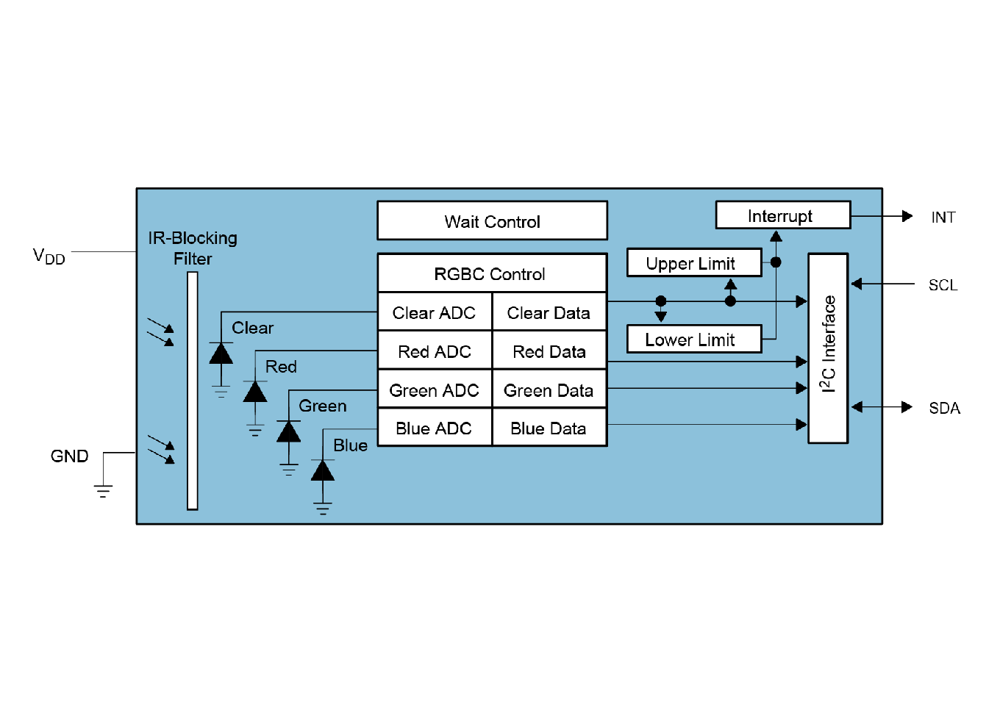

# TCS34725_driver
Platform independent driver for TCS34725 color sensor.

## TCS34725
Sensor communicates over I2C and is made by AMS. Product information can be found [here](https://ams.com/tcs34725)
 - Supply voltage 2.7v - 3.6v
 - Built in IR blocking filter

## Testing
Tested using
 - ESP32 IDF v4.3
 - Adafruit breakout board #1334 found [here](https://www.adafruit.com/product/1334)
